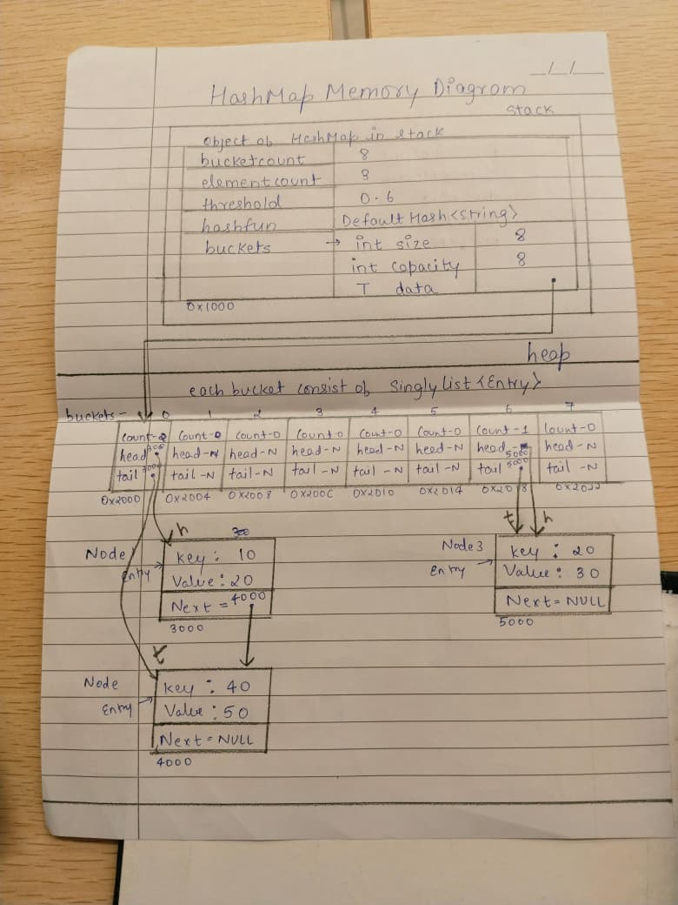

# HashMap
The hash map in this project uses separate chaining with the singly linked list. I kept it simple on purpose. Every key is sent to a bucket by a hash function, and if two keys land in the same bucket, they are stored in the linked list for that bucket.

## Public API
```cpp
template<typename T>
struct DefaultHash {
    size_t operator()(const T& val) const;
};

template<>
struct DefaultHash<int> {
    size_t operator()(int x) const;
};

template<>
struct DefaultHash<char> {
    size_t operator()(char c) const;
};

template<>
struct DefaultHash<std::string> {
    size_t operator()(const std::string& s) const;
};

template<typename Key, typename Value, typename Hash = DefaultHash<Key>>
class HashMap {
    private:
        struct Entry {
            Key key;
            Value value;
            Entry(const Key& k, const Value& v);
            bool operator==(const Entry& other) const;
        };
        DynamicArray<SinglyList<Entry>> buckets;
        int elementcount;
        int bucketcount;
        double threshold;
        Hash hashfun;
        size_t BucketIndex(const Key& key) const;
        double loadfactor() const;
        void deepcopy(const HashMap& map);
    public:
        HashMap(int inibucketcount = 16, double loadfactor = 0.75);
        HashMap(const HashMap& map);
        HashMap& operator=(const HashMap& map);

        void insert(const Key& k, const Value& v);
        bool get(const Key& k, Value& v) const;
        void remove(const Key& k);
        void clear();
        void rehash();
        bool exists(const Key& k) const;
        int size() const;
        int bucketCount() const;
        double loadFactor() const;
        bool isEmpty() const;
        void debugPrint() const;
        int collisions() const;
        void print() const;
};
```

* The hash map is templated, so it can store any key and value types.
* I kept a separate hash functor so custom key types can be supported later.
* The bucket table uses `DynamicArray`, and each bucket stores a `SinglyList` of entries.
* `get()` returns `bool` and writes the value through a reference, which keeps the API easy to use.
* `threshold` controls when rehashing happens, so the table does not get too crowded.

## Internal Representation



### Rule of Three
- Destructor: clears the buckets and releases the table memory.
- Copy constructor: creates a new bucket table and copies all entries into it.
- Assignment operator: replaces the current table with a deep copy of the other map.
- I did not use shallow copy because it would make both maps share the same buckets and lists, which is unsafe.

## Time Complexity

**insert(const Key& k, const Value& v)**
* **Best / Average Case:** O(1)
* **Worst Case:** O(n)
* **Why:** the hash gives the bucket index quickly, but rehashing or a long collision chain can make it slower.

**get(const Key& k, Value& v) / exists(const Key& k)**
* **Best / Average Case:** O(1)
* **Worst Case:** O(n)
* **Why:** most of the time the key goes straight to the right bucket, but collisions can force list traversal.

**remove(const Key& k)**
* **Best / Average Case:** O(1)
* **Worst Case:** O(n)
* **Why:** finding the bucket is fast, but removing from the middle of a chain may need traversal.

**rehash()**
* **Best / Average / Worst Case:** O(n)
* **Why:** every stored entry has to be visited again and placed into a new bucket table.

**clear()**
* **Best / Average / Worst Case:** O(n)
* **Why:** each bucket and every node in every chain has to be cleared.

**size() / bucketCount() / loadFactor() / isEmpty()**
* **Best / Average / Worst Case:** O(1)
* **Why:** these methods only read stored counters or do a small amount of arithmetic.

## Design Decisions

* I used separate chaining because it is simple and works well with the linked list already in the project.
* The table starts with a small default bucket count and grows when the load factor gets too high.
* A load factor of `0.75` is a good balance for this project, so I kept that as the default.
* I kept the hash function customizable so the map can work with more than just basic types.
* `print()` and `debugPrint()` are kept in the class because they are useful for testing and understanding what the table is doing.
