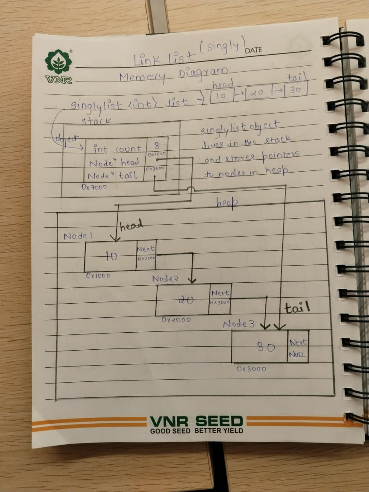

# LinkedList
The linked list in this project is a simple singly linked list. I used it because it is easy to manage by hand and it fits nicely as the collision list inside the hash map. Every node is created on the heap, and when a node is removed or the whole list is cleared, that memory is released properly.

## Public API
```cpp
template<typename T>
class SinglyList {
    private:
        struct Node {
            T data;
            Node* next;
            Node(const T& value);
        };
        Node* head;
        Node* tail;
        int count;
        Node* allocate(const T& value);
        void destruct(Node* node);
        void init();
        void deepcopy(const SinglyList& list);
    public:
        SinglyList();
        SinglyList(const SinglyList& list);
        void swap(SinglyList& other);
        SinglyList& operator=(const SinglyList& list);
        template<typename Iterator>
        SinglyList(Iterator start, Iterator end);
        void insert(int index, const T& value);
        void append(const T& value);
        void insertFront(const T& value);
        void remove(int index);
        void removeFront();
        bool get(int index, T& value) const;
        int search(const T& value) const;
        void clear();
        void print() const;
        int size() const;
        T& operator[](int index);
        const T& operator[](int index) const;
        bool isEmpty() const;
        ~SinglyList();
};
```

* The list is templated, so it can store any type the user wants.
* The `head`, `tail`, and `count` members make the common operations easier to keep track of.
* `get()` returns `bool` instead of throwing, so safe lookup is simple.
* `search()` returns the index of the value, and `-1` if it is not found.
* The iterator constructor lets the list be built from arrays or other iterable containers.

## Internal Representation



### Rule of Three
- Destructor: walks through the list and deletes every node.
- Copy constructor: makes a new list by copying each node one by one.
- Assignment operator: clears the old list and then makes a deep copy.
- I avoided shallow copy because two lists pointing to the same nodes would cause double delete problems.

## Time Complexity

**append(const T& value) / insertFront(const T& value)**
* **Best / Average / Worst Case:** O(1)
* **Why:** the list already keeps a tail pointer, so adding at the end or front does not need traversal.

**insert(int index, const T& value) / remove(int index)**
* **Best Case:** O(1) when working at the front
* **Average / Worst Case:** O(n)
* **Why:** for most positions the list has to walk node by node until it reaches the right spot.

**get(int index, T& value) / operator[](int index)**
* **Best / Average / Worst Case:** O(n)
* **Why:** a linked list does not give direct random access, so it must move through nodes one at a time.

**search(const T& value)**
* **Best Case:** O(1) if the value is at the head
* **Average / Worst Case:** O(n)
* **Why:** the list compares each node until it finds a match or reaches the end.

**clear() / size() / isEmpty()**
* **clear():** O(n)
* **size():** O(1)
* **isEmpty():** O(1)
* **Why:** clearing has to delete every node, but size and empty checks only read stored counters or pointers.

## Design Decisions

* Keeping both `head` and `tail` makes front and back insertions easy.
* Storing `count` as a member lets `size()` stay constant time.
* The `search()` method returns the index because that is more useful than a plain yes/no result.
* This list is also a good fit for hash map chaining because it stays simple and memory usage stays low.
* I implemented operator[] for convenience even though random access in a linked list is O(n)
